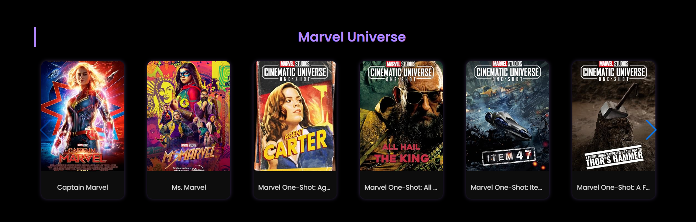
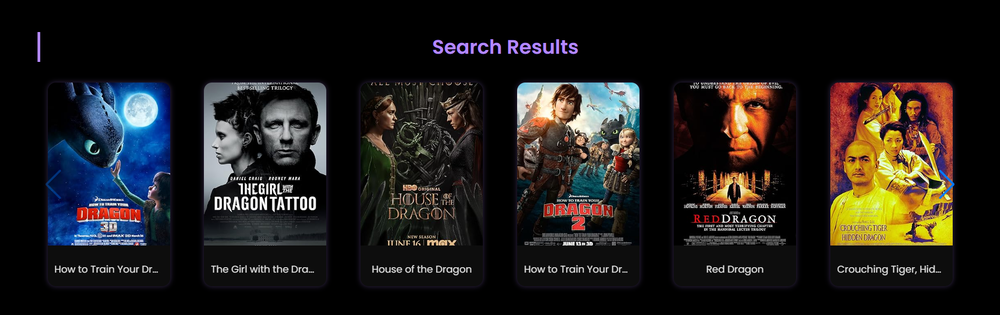

# Movie Browser

Movie Browser is a sleek and responsive React application built with Vite that lets users search, browse, and explore movies using the OMDb API. Featuring categorized movie sliders and a powerful search functionality, it’s your one-stop app to discover films across genres and franchises like Marvel and DC.

Access the webpage here: https://hemanthnagaraj04.github.io/MovieBrowser/

## Features

- Search movies by title with instant results  
- Browse curated categories like Action, Drama, Marvel, and DC movies  
- Smooth horizontal sliders showcasing movie posters  
- Responsive and modern UI design  
- Placeholder images for missing posters  
- Clean, maintainable React codebase with environment variable support for API keys

## Screenshots

  
*Home page with search bar and featured categories*

  
*Differnet Browse curated categories like Action, Drama, Marvel, and DC movies*

  
*Search results displayed in a slider*

## Technologies Used

- React (with hooks)  
- Vite for fast development and bundling  
- OMDb API for movie data  
- CSS Flexbox and Grid for layout  
- Environment variables for secure API key management
